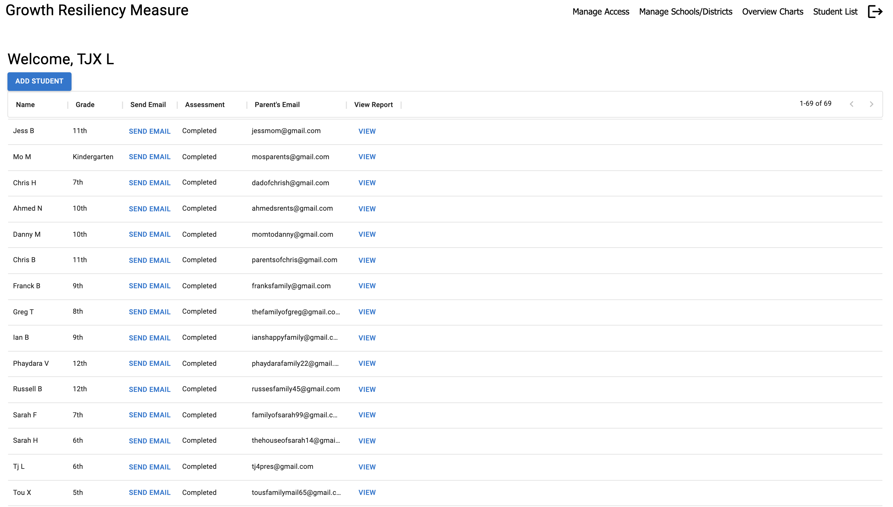
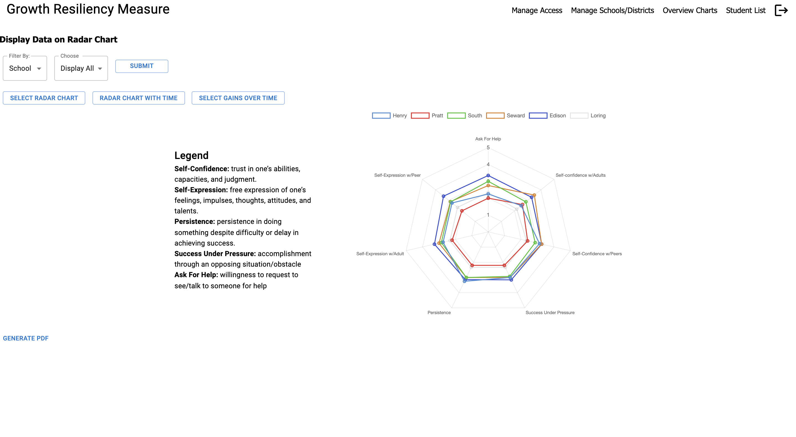

# Growth Resiliency Measure Application
---
## Description
*Duration: 2 Week Sprint*
Text Description of Application here
## Screenshots and Usage

The user login page. Teachers and admins can log in, students cannot.

Teachers given access by an admin will see a list of students enrolled in their school. Clicking 'Add Student' opens the 'Add Student' modal. Teachers can send assessments to students and view past assessment data from this datagrid.

The 'Add Student' modal used by teachers to add new students. 

Admins given access by another admin will see a list of all students enrolled in all districts. Admins can also add students, send assessments, and view assessment data.

The manage access component allows a logged-in admin to view admins and teachers that have been given access. In addition, admins can give (or deny) access to new admins and teachers requesting access.

This component allows admins to add new schools to an existing district.

This component allows admins to analyze submitted assessment data. 
## Prerequisites
- A copy of this repository.
- An Internet Browser, such as [Google Chrome](https://www.google.com/chrome/).
- A [SendGrid](https://sendgrid.com) account with API key and verified sender address.
- [Node.js](https://nodejs.org/en/)
- A PostgreSQL database (we highly recommend using [Postico](https://eggerapps.at/postico/)).
- A text editor, such as [VSCode](https://code.visualstudio.com) or [Sublime Text](https://www.sublimetext.com).
## Installation
1. Create a SendGrid account. Verify a sender address and generate an API key.
2. Using a text editor, open this repository. At the root of the project, create a `.env` file containg the following code:
```
SERVER_SESSION_SECRET=ABC
EMAIL_USER=EFG
APIKEY=XYZ
```
To keep your application secure, replace the SERVER_SESSION_SECRET ('ABC') with a long, randomized string. Replace the EMAIL_USER ('EFG') with the verified sender address, which will be used to send verification emails and assessments. Lastly, replace the APIKEY ('XYZ') with the generated SendGrid API key.
3. Create a database called `growth_resiliency` and run the queries provided in `database.sql` (lines 3-115).
4. Open a new terminal window at the project directory. Run `npm install` to install the required dependencies.
5. In the same terminal window, run `npm run server` to start the application server.
6. In a new terminal window, run `npm run client` to start the application client. After a few seconds, the application should open in a new browser tab.
## Deployment
## Technologies
- Javascript
- HTML5/CSS
- React 
- Redux
- Redux-Saga
- Express
- Chartjs
- React-Chartjs-2
- React-Router
- Momentjs
- SweetAlert
- React-to-PDF
- Passport
- Date-FNS
- Wojtekmaj's React-Daterange-Picker
- Nodemailer
- Node-Cron
- PostgreSQL
- Material-UI
## Acknowledgement
Acknowledgement section here.
## Support
Support section here.
 